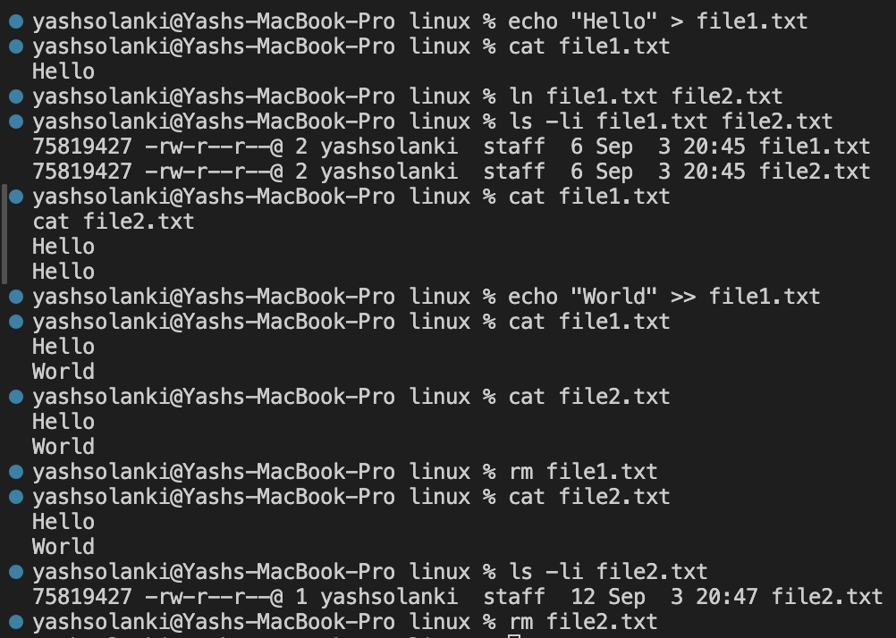
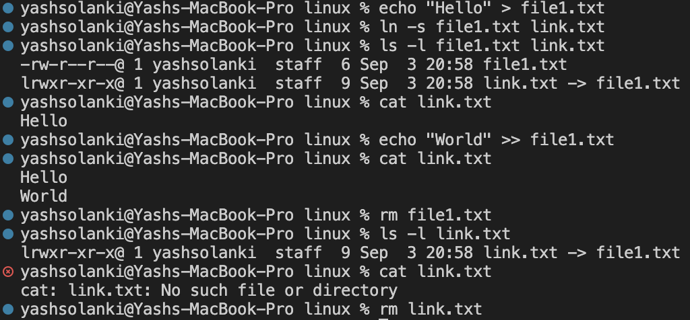
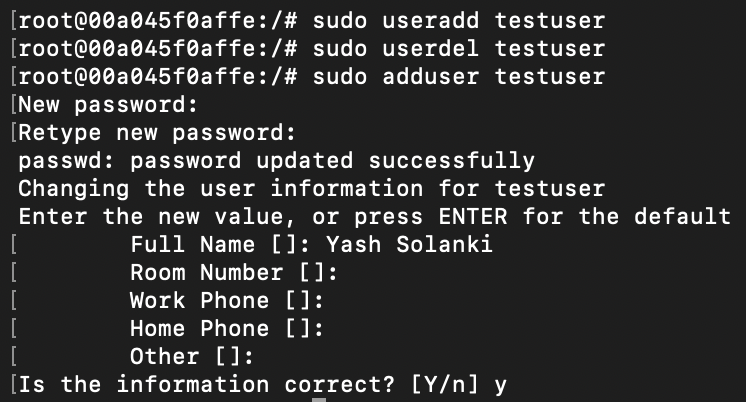
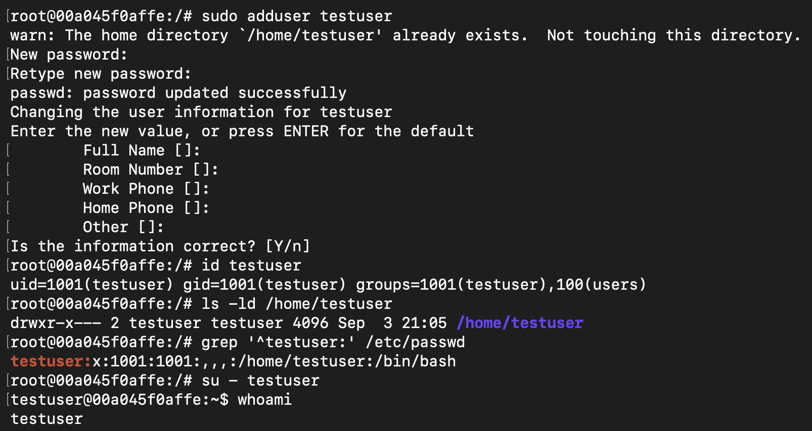
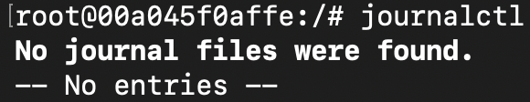

## The Linux commands used.

- `echo` – writes or appends text to files.
- `cat` – displays file contents.
- `ln` – creates hard links.
- `ln -s` – creates symbolic links.
- `ls -li` – displays file information and inode numbers.
- `ls -l` – displays detailed file information.
- `rm` – removes files or links.
- `useradd` – creates a user using a low-level command.
- `userdel` – deletes a user account.
- `adduser` – creates a user through an interactive interface.
- `id` – displays user and group IDs.
- `grep` – searches for matching text.
- `su` – switches to another user account.
- `whoami` – displays the current username.
- `journalctl` – displays systemd journal logs.